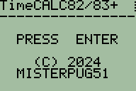
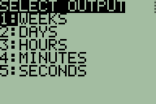
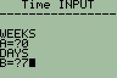
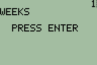

# TimeCALC
TimeCALC is a TI-BASIC program that converts different units of time. This program was made for the TI-82 and TI-83, but it may run on other calculators.

TimeCALC was tested on the following hardware:
**Calculator**|**ROM/OS Version**|**Real/emulated**
:-----:|:-----:|:-----:
TI-82|19|Real
TI-83|1.02|Emulated

