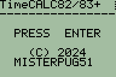
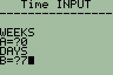
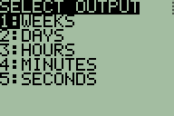
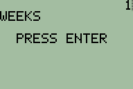

# TimeCALC
TimeCALC is a TI-BASIC program that converts different units of time. This program was made for the TI-82 and TI-83, but it may run on other calculators.

# Tested devices

**Calculator**|**ROM/OS Version**|**Real/emulated**
:-----:|:-----:|:-----:
TI-82|19.0|Real
TI-82|19.0|Emulated
TI-83|1.02|Emulated

# Files
#### TimeCALC 82/83
TimeCALC program (701 Bytes) 
[Download](TimeCALC82-83.8xp)
#### TimeCALC 82/83 Lite
Stripped down version of TimeCALC 82/83. Use this version if you are low on calculator memory. (399 Bytes) 
[Download](timecalc-lite-82-83.8xp)

# Screenshots

 
Start screen
# 
 
Time input screen
# 
 
Output unit select screen
# 
 
Output screen
